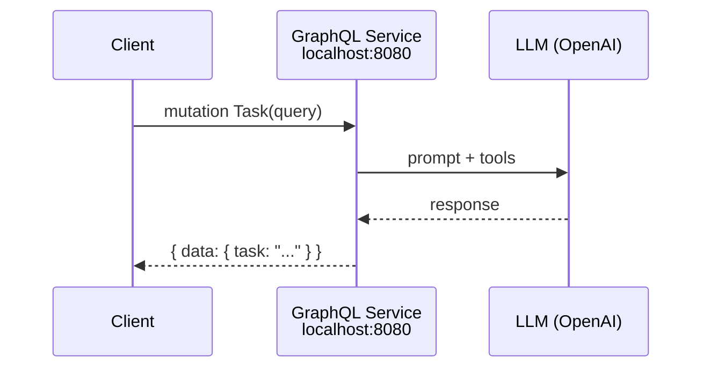

# Build an AI Agent

**Time:** Under 15 minutes | **What you'll build:** An AI agent that connects to an LLM, uses tools, and responds to queries through a GraphQL endpoint.

## Prerequisites

- [WSO2 Integrator extension installed](install.md)
- An OpenAI API key

## Architecture



## Step 1: Create the Project

1. Open the WSO2 Integrator sidebar in VS Code.
2. Click **Create New Integration**.
3. Enter the integration name (e.g., `AIAgent`).

## Step 2: Add a GraphQL Service

1. Add a **GraphQL Service** artifact.
2. Add a mutation named `task` that accepts a `query: string` parameter.

## Step 3: Configure the Inline Agent

1. Inside the mutation, implement an **Inline Agent**.
2. Configure the model provider (WSO2 default or OpenAI).
3. Set up agent memory and tools.

In code:

```ballerina
import ballerina/graphql;
import ballerinax/ai.agent;
import ballerinax/ai.provider.openai;

configurable string openaiKey = ?;

service /graphql on new graphql:Listener(8080) {
    remote function task(string query) returns string|error {
        openai:Client model = check new ({
            auth: {token: openaiKey},
            model: "gpt-4o"
        });

        agent:InlineAgent inlineAgent = check new (
            model: model,
            systemPrompt: "You are a helpful assistant.",
            tools: []
        );

        return check inlineAgent.run(query);
    }
}
```

## Step 4: Configure the API Key

Create a `Config.toml` file:

```toml
openaiKey = "<your-openai-api-key>"
```

## Step 5: Run and Test

1. Click **Run** in the toolbar.
2. Test with curl:

```bash
curl -X POST http://localhost:8080/graphql \
  -H "Content-Type: application/json" \
  -d '{"query": "mutation Task { task(query: \"What is WSO2 Integrator?\") }"}'
```

## Next steps

- [Quick start: Automation](quick-start-automation.md) -- Build a scheduled job
- [Quick start: Integration as API](quick-start-api.md) -- Build an HTTP service
- [Quick start: Event-driven integration](quick-start-event.md) -- React to messages from brokers
- [Quick start: File-driven integration](quick-start-file.md) -- Process files from FTP or local directories
- [GenAI overview](/docs/genai/overview) -- Full guide to AI capabilities
